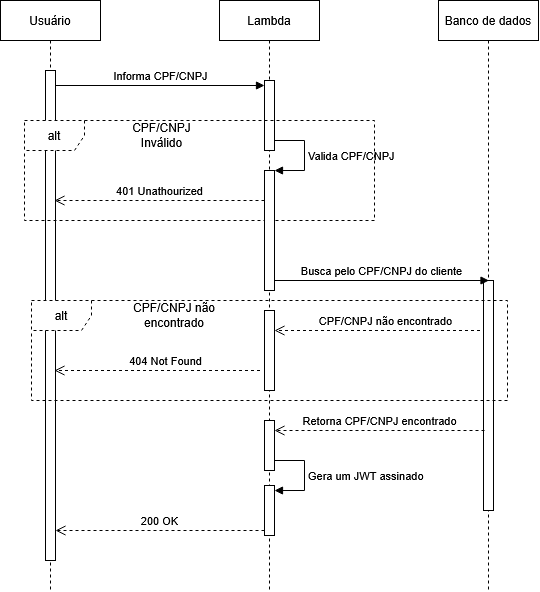

# Mecânica DM - Validação de CPF e Emissão de JWT (Serverless)

Lambda serverless responsável por validar CPF/CNPJ, consultar a base de clientes e
emitir um **JWT** para autenticação na API da oficina. Construída com
**Python 3.11**, **Serverless Framework v3** e publicada na **AWS Lambda**
como integração com **API Gateway HTTP API**.

## Documentação

### Diagrama de sequência



## Endpoint

### `POST /token`

Valida o documento, busca o cliente no banco e emite o token.

**Corpo da requisição:**

```json
{
  "document": "52998224725"
}
```

O campo `cpf` também é aceito por compatibilidade, e o documento pode ser
enviado com ou sem máscara (`529.982.247-25`, `12.345.678/0001-95`).

**Resposta de sucesso (200):**

```json
{
  "token": "eyJhbGciOiJIUzI1NiIs...",
  "token_type": "Bearer",
  "expires_in": 3600
}
```

## Configuração

No ambiente gerenciado, as configurações vêm do **AWS SSM Parameter Store**
(namespace `mecanicadm/{stage}/`). Para desenvolvimento local, use o arquivo
`.env.example` como referência.

## Executar testes

Pré-requisitos: Python 3.11+, Node.js 20+ e npm.

```bash
# Cria o ambiente virtual e instala as dependências
python -m venv .venv
python -m pip install -r requirements.txt -r requirements-dev.txt

# Instala a CLI do Serverless Framework
npm ci

# Executa os testes com cobertura
python -m pytest -v --cov=src --cov-report=term-missing
```

## Deploy

O deploy é feito pela esteira **GitHub Actions** (`.github/workflows/ci-cd.yml`)
ao publicar na branch `main`.

```mermaid
flowchart LR
    A[Push na branch main] --> B[Job: test]
    B --> C[Checkout do código]
    C --> D[Setup Python]
    D --> E[Instala dependências]
    E --> F[Executa testes unitários com cobertura]
    F --> G[Scan SonarQube]
    G -->|passou nos testes| H[Job: deploy - needs test]
    H --> I[Checkout do código]
    I --> J[Configura credenciais AWS]
    J --> K[Setup Node.js]
    K --> L[Instala Serverless Framework]
    L --> M[Deploy da função - stage prod]
```



> O GitHub Actions também possui um workflow de destruição
> (`.github/workflows/destroy.yml`) acionável manualmente, que exige a
> confirmação `DESTRUIR`.

## Stack / Pré-requisitos

- **AWS Lambda** + **API Gateway HTTP API**
- **PostgreSQL** (RDS) em VPC
- **JWT HS256** (PyJWT)
- **Serverless Framework v3** (`serverless-python-requirements`)
- **GitHub Actions** para CI/CD (testes, SonarQube e deploy)
- **SonarQube** para análise estática e cobertura
