# Mecânica DM - Validação de CPF e Emissão de JWT (Serverless)

Lambda serverless responsável por validar CPF/CNPJ, consultar a base de clientes e
emitir um **JWT** para autenticação na API da oficina. Construída com
**Python 3.11**, **Serverless Framework v3** e publicada na **AWS Lambda**
como integração com **API Gateway HTTP API**.

## Documentação

### Diagrama de sequência


## Endpoint

### `POST /token`

Valida o documento, busca o cliente no banco e emite o token.

**Corpo da requisição:**

```json
{
  "document": "52998224725"
}
```

O campo `cpf` também é aceito por compatibilidade, e o documento pode ser
enviado com ou sem máscara (`529.982.247-25`, `12.345.678/0001-95`).

**Resposta de sucesso (200):**

```json
{
  "token": "eyJhbGciOiJIUzI1NiIs...",
  "token_type": "Bearer",
  "expires_in": 3600
}
```

## Configuração

No ambiente gerenciado, as configurações vêm do **AWS SSM Parameter Store**
(namespace `mecanicadm/{stage}/`). Para desenvolvimento local, use o arquivo
`.env.example` como referência.

## Executar localmente (AWS SAM CLI)

A Lambda pode ser executada na sua máquina com o **AWS SAM CLI**, que usa o
container oficial do runtime (Python 3.11) do Lambda — o mesmo comportamento de
produção. O template `template.yaml` é o espelho do `serverless.yml`, e o
`samconfig.toml` guarda os parâmetros da execução local.

> O `serverless-offline` padrão não funciona direto aqui porque o
> `serverless.yml` resolve `${ssm:...}` (exige credenciais AWS em tempo de
> compile); o SAM resolve as variáveis localmente via parâmetros do template.

**Pré-requisitos:** Docker ligado e AWS SAM CLI.
```bash
pipx install aws-sam-cli   # ou a forma que preferir
```

### Passo a passo

```bash
# 1. Banco PostgreSQL local (schema clients + cliente de demonstração)
docker compose -f local/docker-compose.yml up -d

# 2. Build do pacote (usa container para compilar as dependências p/ Linux)
sam build --use-container

# 3. Sobe a API local com o MESMO segredo JWT da API (HTTP em http://localhost:3000)
sam local start-api --parameter-overrides "JWTSecret=development"
```

> Não pule o `--parameter-overrides "JWTSecret=development"`: se a Lambda rodar
> com o default `change-me`, os tokens emitidos serão rejeitados pela API
> (`InvalidTokenException` → HTTP 401). Detalhes na seção abaixo.

### Testando

```bash
# CPF válido e existente no banco -> 200 + JWT
curl -X POST http://localhost:3000/token \
  -H 'Content-Type: application/json' \
  -d '{"document":"529.982.247-25"}'

# Sem documento -> 400 | CPF inválido -> 422 | válido sem cliente -> 404
curl -s -X POST http://localhost:3000/token -H 'Content-Type: application/json' -d '{}'
curl -s -X POST http://localhost:3000/token -H 'Content-Type: application/json' -d '{"document":"111.111.111-11"}'
curl -s -X POST http://localhost:3000/token -H 'Content-Type: application/json' -d '{"document":"123.456.780/00195"}'
```

### Como funciona a conexão com o banco

- O `template.yaml` expõe parâmetros (`DBHost`, `DBUser`, `DBPassword`, etc.)
  com defaults pensados para o Docker local (`local/docker-compose.yml`:
  `admin/admin/mecanicadmdb`).
- O Lambda roda em um container, então `DB_HOST` aponta para
  `host.docker.internal`. O `samconfig.toml` já registra o mapeamento
  `--add-host host.docker.internal:host-gateway` (necessário no Linux) e o
  `DB_SSLMODE=disable` local (o RDS real usa `require`).
- Para apontar para outro banco ou segredo, sobrescreva os parâmetros:
  ```bash
  sam local start-api --parameter-overrides "JWTSecret=development DBHost=meu-host DBPassword=secret"
  ```

### Opções úteis

```bash
sam local invoke ValidateCpfFunction                        # invocação direta (sem HTTP)
sam local invoke ValidateCpfFunction --event event.json     # com evento mock
sam deploy --guided                                         # deploys pela AWS (opcional)
```

## Executar testes

Pré-requisitos: Python 3.11+, Node.js 20+ e npm.

```bash
# Cria o ambiente virtual e instala as dependências
python -m venv .venv
python -m pip install -r requirements.txt -r requirements-dev.txt

# Instala a CLI do Serverless Framework
npm ci

# Executa os testes com cobertura
python -m pytest -v --cov=src --cov-report=term-missing
```

## Deploy

O deploy é feito pela esteira **GitHub Actions** (`.github/workflows/ci-cd.yml`)
ao publicar na branch `main`.

```mermaid
flowchart LR
    A[Push na branch main] --> B[Job: test]
    B --> C[Checkout do código]
    C --> D[Setup Python]
    D --> E[Instala dependências]
    E --> F[Executa testes unitários com cobertura]
    F --> G[Scan SonarQube]
    G -->|passou nos testes| H[Job: deploy - needs test]
    H --> I[Checkout do código]
    I --> J[Configura credenciais AWS]
    J --> K[Setup Node.js]
    K --> L[Instala Serverless Framework]
    L --> M[Deploy da função - stage prod]
```



> O GitHub Actions também possui um workflow de destruição
> (`.github/workflows/destroy.yml`) acionável manualmente, que exige a
> confirmação `DESTRUIR`.

## Stack / Pré-requisitos

- **AWS Lambda** + **API Gateway HTTP API**
- **PostgreSQL** (RDS) em VPC
- **JWT HS256** (PyJWT)
- **Serverless Framework v3** (`serverless-python-requirements`)
- **GitHub Actions** para CI/CD (testes, SonarQube e deploy)
- **SonarQube** para análise estática e cobertura
